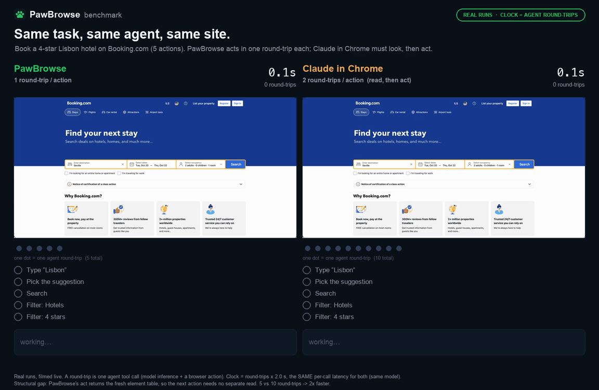

<p align="center">
  
</p>

<h1 align="center">
   PawBrowse
</h1>

<p align="center"><strong>Let your AI coding agent drive the real Chrome you already use — logged in, no keys, no second AI.</strong></p>

<p align="center">
<a href="https://www.npmjs.com/package/pawbrowse"></a>
<a href="https://chromewebstore.google.com/detail/ppfdoledneneiaflggcfogecfnhkmloe"></a>
<a href="https://github.com/ItaiZeilig/pawbrowse/actions/workflows/ci.yml"></a>
<a href="LICENSE"></a>

<a href="https://claude.com/claude-code"></a>
<a href="https://modelcontextprotocol.io"></a>
</p>

<p align="center">
  <a href="assets/demo.mp4"></a>
</p>

<p align="center"><sub>
A real run on live Google Flights at <b>1× speed</b> — every frame is the original screencast, and the result is checked from the page itself. <a href="assets/demo.mp4">MP4</a>
</sub></p>

**PawBrowse gives your coding agent hands and eyes in the browser you're already signed into.**
It's a small **Chrome extension + a one-file MCP server** (zero dependencies). Your agent — Claude Code,
Cursor, VS Code, Claude Desktop, anything that speaks MCP — can **see and click your actual tabs**: your
profile, your logins, your open pages. No remote-debug port, no relaunch, **no second AI model, no API
key.** The agent you already trust is the only brain in the loop.

The same power as the first-party Claude-in-Chrome extension — but **yours, open source, auditable, and
[about 2× fewer round-trips](#why-its-fast)** because it reads pages as a table instead of screenshotting them.

---

## Try it — about 30 seconds

Two clicks and one line. 👇

### 1. Add the extension to Chrome

[](https://chromewebstore.google.com/detail/ppfdoledneneiaflggcfogecfnhkmloe)

One click on the **[Chrome Web Store](https://chromewebstore.google.com/detail/ppfdoledneneiaflggcfogecfnhkmloe)** — that's the "hands and eyes" in your browser.

### 2. Connect your agent

<p>
<a href="cursor://anysphere.cursor-deeplink/mcp/install?name=pawbrowse&config=eyJjb21tYW5kIjoibnB4IiwiYXJncyI6WyIteSIsInBhd2Jyb3dzZUBsYXRlc3QiXX0="></a>
<a href="https://insiders.vscode.dev/redirect/mcp/install?name=pawbrowse&config=%7B%22command%22%3A%22npx%22%2C%22args%22%3A%5B%22-y%22%2C%22pawbrowse%40latest%22%5D%7D"></a>
<a href="https://github.com/ItaiZeilig/pawbrowse/raw/main/dist/pawbrowse.mcpb"></a>
</p>

- **Claude Desktop** — click the badge, then **double-click** the downloaded `pawbrowse.mcpb` (or drag it into **Settings → Extensions**) and hit **Install**. No command, no config.
- **Cursor / VS Code** — click the badge and approve.
- **Claude Code** — paste one line:

  ```bash
  claude mcp add --scope user pawbrowse -- npx -y pawbrowse@latest
  ```

### 3. Restart your client and just ask

> *"use pawbrowse: what's my browser status?"*

You should see `extension_connected: true`, and the extension badge turns **green ●**. 🎉 You're driving.

<sub>Needs **Node.js ≥ 18**. Nothing to clone or build — the button/line just runs `npx -y pawbrowse@latest`. Prefer to build from source or contribute? See **[CONTRIBUTING.md](CONTRIBUTING.md)**.</sub>

## What can I ask it?

You never call the tools yourself — you talk to your agent in plain English, and it drives whatever tab you point it at:

- *"Open news.ycombinator.com and give me the top 5 story titles."*
- *"On this tab, search for 'open source license' and open the first result."*
- *"Fill the signup form with my name and email — but don't submit."*
- *"Go to my GitHub notifications and tell me what's new."*

It works on the tab **you already have open and are logged into** — no separate window, no re-login. Name a tab and it uses that one; otherwise it uses the active tab.

## How it works — it reads pages as a table, not screenshots

Every time it looks, PawBrowse hands your agent a compact, numbered list of the **clickable things in view** — with real accessible names, current values, and state flags — instead of a screenshot:

```
Web browser - Wikipedia  —  https://en.wikipedia.org/wiki/Web_browser
scroll 0/6361  ·  83 controls
e2   fill    "Search Wikipedia"
e6   click   "Log in"
e10  click   "2 History"
e13  click ▾ "Toggle Browser market subsection"
e9   click✓  "Remember me"
e3   select  "Country"  opts{US | UK | ...}
```

<sub>Flags after the kind: `✓`/`·` checked/unchecked · `▾`/`▸` expanded/collapsed · `◉` selected.</sub>

Each ref (`e10`) is a **stable handle** to a real element, and every action **returns the fresh table**. So your agent acts in **one round-trip** — no "screenshot, think, screenshot again." That's the whole speed story ([benchmark below](#why-its-fast)), and it's cheaper in tokens too.

Under the hood it's boringly simple: a Chrome MV3 extension drives your tabs through Chrome's built-in
`chrome.debugger` (CDP — no debug port, no relaunch), and a one-file MCP server bridges it to your agent
over localhost. Open as many editors/agents as you like — the first one starts a shared *broker*, and each
session gets its **own 🐾 tab group** so nothing fights over the port or a tab.

```
Claude Code ──stdio (MCP)──▶ mcp/server.mjs ─┐
Cursor      ──stdio (MCP)──▶ mcp/server.mjs ─┼─IPC─▶ broker ──ws://127.0.0.1:10577──▶ Chrome extension ──CDP──▶ your real tabs
VS Code     ──stdio (MCP)──▶ mcp/server.mjs ─┘                                              │
                                                                    each session ⇒ its own 🐾 tab group
```

## Why it's fast

<p align="center">
  <a href="assets/benchmark.mp4"></a>
</p>

<p align="center"><sub>
Same task on live Booking.com (book a 4-star Lisbon hotel — 5 actions), same agent (Claude), same real Chrome, both filmed live.
The clock counts <strong>agent round-trips</strong>: one tool call = one round-trip, at the same per-call latency for both. <a href="assets/benchmark.mp4">MP4</a>
</sub></p>

| | PawBrowse | Claude in Chrome |
| --- | --- | --- |
| Round-trips for the 5 actions | **5** — 1 per action | 10 — 2 per action (read, then act) |
| Screenshots / reads to see the page | **0** — every act returns the fresh table | 5 — one before each action |
| Relative agent time | **1×** | ~2× |

> **Why:** the agent loop is round-trip-bound — each tool call is a full model inference. PawBrowse's
> `act` returns the next screen already perceived, so an action is **one** round-trip; a perceive-then-act
> driver needs **two**. Same task, same model → same per-call latency, so the **round-trip count is the
> gap**: 5 vs 10 → ~2×.
>
> **Honest caveats:** the clock is round-trips × a fixed, equal per-call latency — it isolates the
> structural difference and drops network noise, it's not a stopwatch. One run each; an illustration, not
> a statistic. Reproduce: `scripts/demo/peek-record.mjs` films each tab, `scripts/demo/render_race.py`
> renders it.

## How it compares

| | Claude-in-Chrome | **PawBrowse** |
| --- | --- | --- |
| Drives your real, logged-in Chrome | ✅ | ✅ (`chrome.debugger`, no port) |
| Decision model | Claude | **Claude — no second model, no key** |
| Perception | screenshots + a11y tree | **compact element table** |
| Round-trips per action | 2 (perceive → act) | **1** (stable refs) |
| Page data to a third party | no | **no** |
| Per-site permission gate | yes (allowlist) | no |
| Open source / self-owned | ❌ | **✅ MIT, zero-dep** |
| Works with any MCP client | ❌ | **✅** |

## The tools

You won't call these directly — your agent does — but here's the whole surface:

| Tool | What it does |
| --- | --- |
| `browser_status` | Connection + attached-tab diagnostics. Call first if anything's off. |
| `browser_tabs` | List open tabs (`id`, `title`, `url`, `active`). |
| `browser_navigate` | `{ url, tabId? }` → element table after load. |
| `browser_observe` | `{ tabId? }` → the element table. |
| `browser_read` | `{ tabId?, max_chars? }` → the page's readable prose (articles, docs, rules). |
| `browser_act` | `{ ops: [...], tabId? }` → runs ops in order, returns a fresh table + a "page changed?" signal. |
| `browser_assert` | `{ contains? \| url_includes? \| ref_visible?, tabId? }` → prove an outcome (pass/fail). |

**Ops for `browser_act`:** `{op:"click",ref:"e12"}` · `{op:"click_text",text:"..."}` (custom
widgets/menus not in the table) · `{op:"click_xy",x,y}` (canvas / custom-drawn UI) ·
`{op:"type",ref:"e7",text:"..."}` · `{op:"select",ref:"e8",value:"..."}` · `{op:"hover",ref:"e5"}` ·
`{op:"drag",ref:"e5",to:"e9"}` · `{op:"upload",ref:"e3",paths:["/abs/file.pdf"]}` ·
`{op:"key",key:"Enter"}` · `{op:"scroll",dy:600}` · `{op:"wait",ms:500}`.

## Built to be trustworthy

Two questions everyone has: *does it break?* and *where does my data go?*

**It's hardened.** Two multi-agent code audits plus live testing on real sites went into these:

- **Hit-tested clicks** — it re-resolves each element live and checks the center isn't covered before clicking, so it never hits a stale, moved, or occluded target.
- **Semantic freshness guard** — an element's role + name is fingerprinted, and a silently relabeled target is rejected ("observe again") instead of mis-clicked.
- **Robust typing** — select-all + `insertText` (works with React/controlled inputs); typed comboboxes wait for autocomplete to render.
- **Background-tab safe** — uses `setTimeout`-based waits (not `requestAnimationFrame`, which Chrome pauses in background tabs), so driving a tab you aren't looking at doesn't hang.
- **No double-execution & an unwedgeable queue** — overlapping calls can't race the debugger, and one hung command can't block the rest.

**It stays on your machine.** No model, no API key, no telemetry.

- Page content it reads goes **only** to the local agent you run — never to any third-party server. `password`, `file`, and `hidden` inputs are excluded and never exposed (other visible fields *are* in the table, so treat what's on screen as visible to your agent).
- The bridge binds to `127.0.0.1`, rejects non-`chrome-extension://` origins, and trusts only the current extension socket. It assumes other software on your machine is trusted — the same as most localhost dev tools; a per-pair token is planned hardening.
- The extension declares `debugger` (plus `tabs`, `storage`, `alarms`) and **no host permissions**. The only thing stored is your bridge port number.
- Fully auditable: the server is one zero-dependency file, the extension is plain JS.

Full details: **[SECURITY.md](SECURITY.md)** · **[PRIVACY.md](PRIVACY.md)**. Found a vulnerability? Please don't open a public issue — see SECURITY.md.

## Honest limits

- Attaching shows Chrome's *"PawBrowse is debugging this browser"* banner — expected.
- One debugger client per tab: a tab with DevTools open (or driven by another extension) can't be attached — switch tabs or close DevTools.
- `chrome://`, the Chrome Web Store, and other browser pages can't be driven (Chrome blocks automation there).
- **Multiple clients run at once** — a shared broker owns the port and gives each session (Claude Code, Cursor, Claude Desktop…) its own 🐾 tab group, so several agents can drive the browser simultaneously. The only catch is the per-tab rule above: two sessions can't drive the *same* tab.
- **Reads open shadow DOM + same-origin iframes** — their controls are in the table and clickable. It can also *act* inside cross-origin iframes (via a child debugger session) and do **file uploads** (`upload` op, once you enable *Allow access to file URLs* for the extension). What it **can't read** is cross-origin iframe *text* (payment fields stay opaque) and canvas — use the screenshot + `click_xy` there.

## Troubleshooting

| Symptom | Fix |
| --- | --- |
| Badge never turns green | The server isn't running — make sure you **fully restarted** your client after `claude mcp add` (a `/mcp` reconnect alone won't relaunch it). |
| "No extension connected" | Reload the extension at `chrome://extensions`, then re-run `browser_status`. |
| "Another debugger is already attached" | That tab has DevTools open or another extension driving it — close DevTools or switch tabs. |
| A `chrome://` / Web Store page won't drive | Those are browser pages Chrome blocks from automation — use a normal web page. |
| Changed the port | Set the same port in the extension's **Options** and in `--env PAWBROWSE_PORT=…`. |

<sub>Requires **Node ≥ 18** (≥ 22 to run the test suite). Works on Chrome, Edge, and Brave.</sub>

## Contributing

PRs welcome! See **[CONTRIBUTING.md](CONTRIBUTING.md)** for dev setup and tests (`npm test`), and the
**[Code of Conduct](CODE_OF_CONDUCT.md)**. Questions? **[SUPPORT.md](SUPPORT.md)**.

## Credits

Built with [Claude Code](https://claude.com/claude-code). Some page-perception and action-execution
techniques are adapted from [browser-use/jev-ultrafast](https://github.com/browser-use/jev-ultrafast)
(MIT); this credit is kept as required by that project's license.

## License

[MIT](LICENSE) © PawBrowse contributors.
